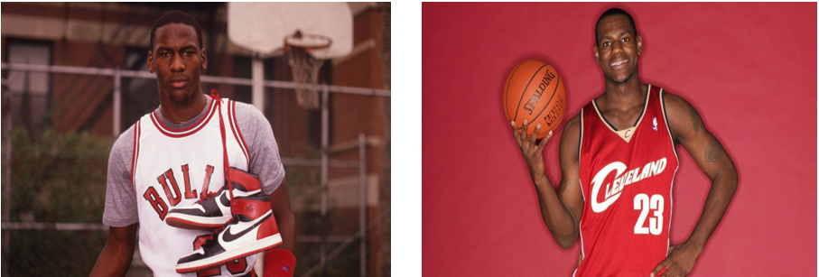
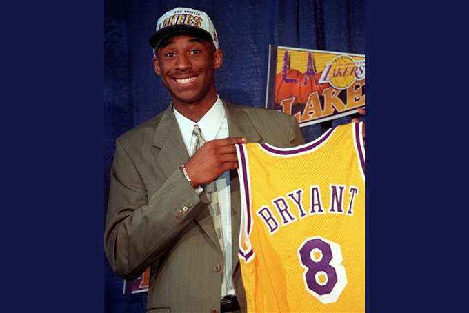

 

SLO High School 
========================================================
author: Immanuel Williams Ph.D.
date: September 11, 2019 
autosize: true
font-import: http://fonts.googleapis.com/css?family=Bree Serif
font-family: 'Bree Serif'
css: style.css

<!-- TO Change Fonts -->
<!-- https://fonts.google.com/ -->
Who is the G.O.A.T.?
========================================================
Who is the better player Jordan or James?

Let's do a poll:
- Raise your hand for Jordan
- Raise your hand for James 

An Even Harder Question...
========================================================
Should Kobe Byrant be added to this discussion?

Let's do a poll: 
- Raise your hand if Kobe should be added
- Raise your hand if Kobe should **NOT** be added

Lets Hear It!
========================================================
incremental: true
Raise your hand and let us hear your opinion!!

 
 

Can you back up your claims with up data???

Facts
========================================================
incremental: true
**Valid Points**, but let's look at the data together 

 
<table class='gmisc_table' style='border-collapse: collapse; margin-top: 1em; margin-bottom: 1em;' >
<thead>
<tr>
<th style='border-bottom: 1px solid grey; border-top: 2px solid grey; text-align: center;'></th>
<th style='border-bottom: 1px solid grey; border-top: 2px solid grey; text-align: center;'>Jordan</th>
<th style='border-bottom: 1px solid grey; border-top: 2px solid grey; text-align: center;'>Bryant</th>
<th style='border-bottom: 1px solid grey; border-top: 2px solid grey; text-align: center;'>James</th>
</tr>
</thead>
<tbody>
<tr>
<td style='padding-left: .5em; padding-right:
                 .5em; align: left; vertical-align: top; text-align: center;'>Height</td>
<td style='padding-left: .5em; padding-right:
                 .5em; align: left; vertical-align: top; text-align: center;'>6 ft 6 in. (1.98 m)</td>
<td style='padding-left: .5em; padding-right:
                 .5em; align: left; vertical-align: top; text-align: center;'>6 ft 6 in. (1.98 m)</td>
<td style='padding-left: .5em; padding-right:
                 .5em; align: left; vertical-align: top; text-align: center;'>6 ft 8 in. (2.03 m)</td>
</tr>
<tr>
<td style='padding-left: .5em; padding-right:
                 .5em; align: left; vertical-align: top; text-align: center;'>Weight</td>
<td style='padding-left: .5em; padding-right:
                 .5em; align: left; vertical-align: top; text-align: center;'>216 lb</td>
<td style='padding-left: .5em; padding-right:
                 .5em; align: left; vertical-align: top; text-align: center;'>212 lb</td>
<td style='padding-left: .5em; padding-right:
                 .5em; align: left; vertical-align: top; text-align: center;'>250 lb</td>
</tr>
<tr>
<td style='padding-left: .5em; padding-right:
                 .5em; align: left; vertical-align: top; text-align: center;'>Positions</td>
<td style='padding-left: .5em; padding-right:
                 .5em; align: left; vertical-align: top; text-align: center;'>Shooting Guard</td>
<td style='padding-left: .5em; padding-right:
                 .5em; align: left; vertical-align: top; text-align: center;'>Shooting Guard</td>
<td style='padding-left: .5em; padding-right:
                 .5em; align: left; vertical-align: top; text-align: center;'>Small Forward, Power Forward</td>
</tr>
<tr>
<td style='padding-left: .5em; padding-right:
                 .5em; align: left; vertical-align: top; text-align: center;'>NBA Finals</td>
<td style='padding-left: .5em; padding-right:
                 .5em; align: left; vertical-align: top; text-align: center;'>6</td>
<td style='padding-left: .5em; padding-right:
                 .5em; align: left; vertical-align: top; text-align: center;'>5</td>
<td style='padding-left: .5em; padding-right:
                 .5em; align: left; vertical-align: top; text-align: center;'>3</td>
</tr>
<tr>
<td style='padding-left: .5em; padding-right:
                 .5em; align: left; vertical-align: top; text-align: center;'>NBA All-Star Game Selections</td>
<td style='padding-left: .5em; padding-right:
                 .5em; align: left; vertical-align: top; text-align: center;'>14</td>
<td style='padding-left: .5em; padding-right:
                 .5em; align: left; vertical-align: top; text-align: center;'>18</td>
<td style='padding-left: .5em; padding-right:
                 .5em; align: left; vertical-align: top; text-align: center;'>15</td>
</tr>
<tr>
<td style='padding-left: .5em; padding-right:
                 .5em; align: left; vertical-align: top; text-align: center;'>All-Star MVPs</td>
<td style='padding-left: .5em; padding-right:
                 .5em; align: left; vertical-align: top; text-align: center;'>3</td>
<td style='padding-left: .5em; padding-right:
                 .5em; align: left; vertical-align: top; text-align: center;'>4</td>
<td style='padding-left: .5em; padding-right:
                 .5em; align: left; vertical-align: top; text-align: center;'>3</td>
</tr>
<tr>
<td style='padding-left: .5em; padding-right:
                 .5em; align: left; vertical-align: top; border-bottom: 2px solid grey; text-align: center;'>Number of Seasons</td>
<td style='padding-left: .5em; padding-right:
                 .5em; align: left; vertical-align: top; border-bottom: 2px solid grey; text-align: center;'>15</td>
<td style='padding-left: .5em; padding-right:
                 .5em; align: left; vertical-align: top; border-bottom: 2px solid grey; text-align: center;'>20</td>
<td style='padding-left: .5em; padding-right:
                 .5em; align: left; vertical-align: top; border-bottom: 2px solid grey; text-align: center;'>16</td>
</tr>
</tbody>
<tr><td colspan='4' style='text-align: left;'>
Source:  www.basketball-reference.com</td></tr>
</table>

What type 
of information would help compare these players better?
<!-- Lets look at position, which position did each player play? -->
<!-- - MJ and KB played shooting guard  -->
<!-- LJ  played power forward  and small forward  -->
<!-- It is known that Kobe also played... -->
<!-- Shooting guard main responsibilities are to shoot and pass the ball -->
<!-- Power forward main responsibility it to rebound and .... -->
<!-- Small forward main responsibility is to... -->
<!-- Why do you mentioning there position is important? -->
<!-- What about the rings? Who had more championships? But Who appeared in more? -->
<!-- What about rookie of the year, who earned it? MJ and LJ but not Kobe -->
<!-- Lebron and Jordan but not Kobe. -->
<!-- There are alot of accolades here and in general but let's look at one more comparison ... -->
<!-- Let's look at the each players time line so that we get a better understanding of each player's brief history  -->

First Season 
========================================================
incremental: true
Let's Look at their 1st seaon in the NBA in terms of:
- Points (Jitter Plot)
- Assists (Histogram)
- Defensive Rebounds (Box Plot)
- Offensive Statistics (Radar Plot)
- Defensive Statistics (Heatmap)

It's not enough... 
========================================================
incremental: true
To only look at the first year.

Should Kobe Bryant be added to this discusion? 

Get in groups of 3 to work to answer this question.

Select 3 different graphics to answer this question. Provide
two sentences that explain why you choose this graphic and how
does it answer the question.

